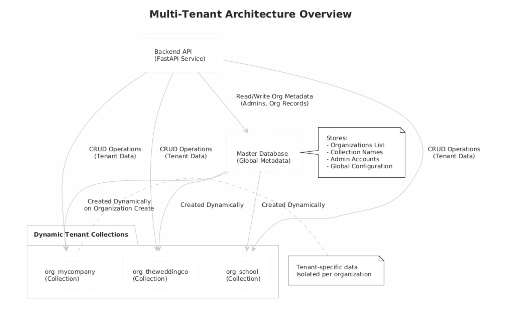

# **Organization Management System (Full-Stack)**

A complete **multi-tenant backend + modern frontend** for managing organizations, admins, and isolated collections.
Built with **FastAPI**, **MongoDB**, **React**, **TailwindCSS**, and **Docker Compose**.

---

# **📌 Features**

### **Backend (FastAPI)**

* Multi-tenant architecture using **dynamic collections**
* Secure Admin Authentication (JWT)
* Organization CRUD (Create, Read, Update, Delete)
* Per-organization isolated data through dynamic MongoDB collections
* CORS enabled
* Bcrypt hashing (with 72-byte safety fix)
* Environment-based configuration
* Docker-ready FastAPI deployment

### **Frontend (React + Vite + TailwindCSS)**

* Dark-themed, fully responsive UI
* Create Organization
* Admin Login
* Dashboard for fetching organization metadata
* Email & password validation
* Show/Hide password toggle
* Environment-based API URL
* Axios API client

### **DevOps / Deployment**

* Docker Compose (Mongo + Backend + Frontend)
* Persistent MongoDB volume
* Nginx-powered frontend container

---

# **📁 Folder Structure**

```
full_stack_project/
│── backend/
│   ├── app/
│   │   ├── routes/
│   │   ├── services/
│   │   ├── core/
│   │   ├── db/
│   │   ├── middleware/
│   │   └── models/
│   ├── Dockerfile
│   ├── requirements.txt
│   └── .env.example
│
│── frontend/
│   ├── src/
│   ├── Dockerfile
│   ├── vite.config.js
│   └── .env.example
│
│── docker-compose.yml
│── README.md
```

---

# **⚙️ Backend Setup (FastAPI)**

## **1. Prepare environment**

```sh
cd backend
cp .env.example .env
```

Example `.env`:

```env
MONGO_URL=mongodb://mongo:27017
DB_NAME=org_master
JWT_SECRET=supersecretkey
JWT_ALGO=HS256
ACCESS_TOKEN_EXPIRE_MINUTES=60
BACKEND_PORT=8000
```

---

## **2. Run backend locally**

```sh
python3 -m venv .venv
source .venv/bin/activate
pip install -r requirements.txt
uvicorn app.main:app --reload --port 8000
```

---

# **🌐 API Endpoints**

### **Org Routes**

| Method | Endpoint                          | Description                             |
| ------ | --------------------------------- | --------------------------------------- |
| POST   | `/org/create`                     | Create new organization with admin user |
| GET    | `/org/get?organization_name=name` | Fetch organization metadata             |
| PUT    | `/org/update`                     | Update name/email/password              |
| DELETE | `/org/delete`                     | Delete organization                     |

### **Admin Routes**

| Method | Endpoint       | Description                      |
| ------ | -------------- | -------------------------------- |
| POST   | `/admin/login` | Admin login (JWT token returned) |

---

# **🖥️ Frontend Setup (React + Vite)**

## **1. Install & configure**

```sh
cd frontend
npm install
cp .env.example .env
```

`.env`:

```env
VITE_API_BASE_URL=http://localhost:8000
```

---

## **2. Run frontend**

```sh
npm run dev
```

Runs on:

```
http://localhost:5173
```

---

# **🐳 Docker Deployment (Full Stack)**

## **1. Run all services**

```sh
docker compose up --build
```

This starts:

| Service  | URL                                            |
| -------- | ---------------------------------------------- |
| Frontend | [http://localhost:5173](http://localhost:5173) |
| Backend  | [http://localhost:8000](http://localhost:8000) |
| MongoDB  | localhost:27017                                |

---

# **📦 docker-compose.yml**

```yaml
version: '3.8'

services:
  mongo:
    image: mongo:6
    restart: always
    ports:
      - "27017:27017"
    volumes:
      - mongo_data:/data/db

  backend:
    build: ./backend
    restart: unless-stopped
    env_file:
      - ./backend/.env.example
    ports:
      - "8000:8000"
    depends_on:
      - mongo

  frontend:
    build: ./frontend
    ports:
      - "5173:80"

volumes:
  mongo_data:
```

---

# **🏗️ Architecture Overview**

## **Multi-Tenant Architecture Explanation**

* A **master database** holds:

  * Organization metadata
  * Admin users
* Each organization gets **its own isolated MongoDB collection** dynamically
* Admin login is global, but admin actions only apply to their organization
* Ensures:

  * Data isolation
  * Scalability
  * Security

---

# **📊 Multi-Tenant Architecture Diagram (PlantUML)**




---

# **📘 Project Purpose**

This project is built as part of:

**Backend Intern Assignment – Organization Management Service**
Using Multi-Tenant Architecture with secure API design.

---

# **👨‍💻 Author**

**Kotipalli Srikesh**
Registration Number: **RA2211003010979**
LinkedIn: [https://www.linkedin.com/in/kotipalli-srikesh-9487561b9/](https://www.linkedin.com/in/kotipalli-srikesh-9487561b9/)


