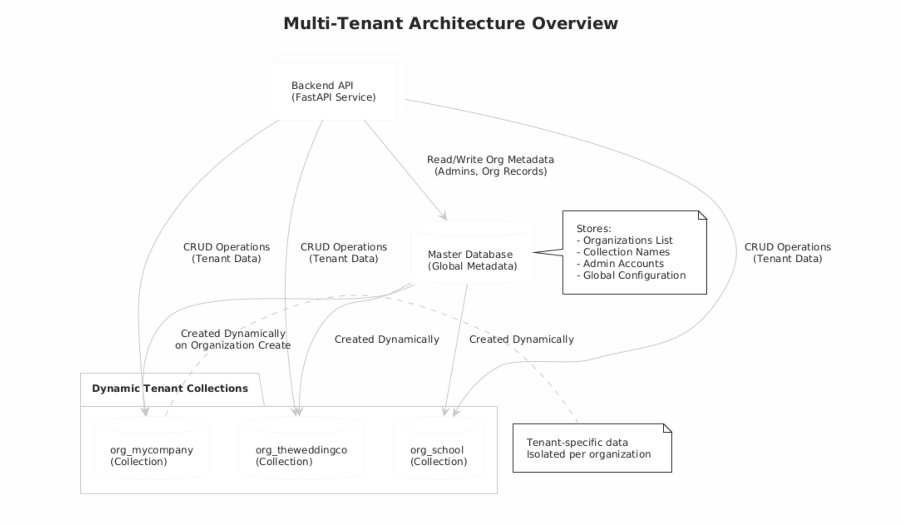

# **Organization Management Service – Backend**

A multi-tenant backend system built using **FastAPI** and **MongoDB**, supporting organization creation, dynamic collection management, and admin authentication.
Designed for backend engineering assignments and production-grade multi-tenant application architectures.

---

## **🚀 Features**

### **1. Multi-Tenant Architecture**

* Single **Master Database** (global metadata)
* Dynamic collections per organization
  Example:

  ```
  org_mycompany
  org_theweddingco
  ```

### **2. Organization Management**

* Create organization
* Fetch organization
* Update organization name
* Delete organization
* Dynamic collection rename

### **3. Administrator Authentication**

* Admin login with JWT tokens
* Secure password hashing (bcrypt with truncation fix)
* Authentication middleware for protected routes

### **4. Clean Code Architecture**

Folders include:

* `/routes`
* `/services`
* `/middleware`
* `/models`
* `/core` (security + config)
* `/db` (Mongo connection)

### **5. Docker Support**

* Fully containerized backend
* Includes docker-compose support (Mongo + Backend + Frontend)

---

## **📁 Project Structure**

```
backend/
│── app/
│   ├── core/
│   │   ├── config.py
│   │   ├── security.py
│   │
│   ├── db/
│   │   ├── mongo.py
│   │
│   ├── middleware/
│   │   ├── auth_middleware.py
│   │
│   ├── models/
│   │   ├── schemas.py
│   │
│   ├── routes/
│   │   ├── admin_routes.py
│   │   ├── org_routes.py
│   │
│   ├── services/
│   │   ├── admin_service.py
│   │   ├── org_service.py
│   │
│   ├── main.py
│
│── requirements.txt
│── Dockerfile
│── .env.example
│── README.md
```

---

## **⚙️ Environment Variables**

Copy the template:

```
cp .env.example .env
```

### **.env File Example**

```
MONGO_URL=mongodb://localhost:27017
DB_NAME=master_db

JWT_SECRET=your_secret_key
JWT_ALGO=HS256
ACCESS_TOKEN_EXPIRE_MINUTES=120

PORT=8000
```

---

## **🛠️ Local Development Setup**

### **1. Create Virtual Environment**

```
python3 -m venv .venv
source .venv/bin/activate
```

### **2. Install Dependencies**

```
pip install -r requirements.txt
```

### **3. Run Server**

```
uvicorn app.main:app --reload --port 8000
```

---

## **🐳 Running with Docker**

### **1. Build + Start Containers**

```
docker-compose up --build
```

### **2. Access Services**

* Backend → [http://localhost:8000](http://localhost:8000)
* MongoDB → localhost:27017

---

## **🔐 Authentication Flow**

1. Admin is created during organization creation (`POST /org/create`)
2. Admin logs in (`POST /admin/login`)
3. API returns JWT token
4. Token must be included in protected requests:

```
Authorization: Bearer <token>
```

---

## **📡 API Endpoints**

### **Organization Routes**

| Method | Endpoint      | Description                            |
| ------ | ------------- | -------------------------------------- |
| POST   | `/org/create` | Create new tenant + admin              |
| GET    | `/org/get`    | Get organization details               |
| PUT    | `/org/update` | Rename org or update admin credentials |
| DELETE | `/org/delete` | Delete org + admin                     |

### **Admin Routes**

| Method | Endpoint       | Description                       |
| ------ | -------------- | --------------------------------- |
| POST   | `/admin/login` | Authenticate admin and return JWT |

---

## **🏗 Multi-Tenant Architecture Diagram**


Each organization gets its **own isolated collection**, enabling scalable multi-tenant design.

---

## **💡 Notes**

* Bcrypt passwords are auto-truncated to 72 bytes (bcrypt limitation fix added).
* Dynamic collection renaming is handled atomically.
* CORS enabled globally for frontend integration.
* Uses `motor` (async MongoDB driver) for high-performance I/O.

---

## **📜 License**

This project is provided as part of a **Backend Engineering Internship Assignment**
for demonstrating backend architecture, authentication, and multi-tenant design.

---

## **✍️ Author**

**Kotipalli Srikesh**
Backend Engineer
LinkedIn: [https://www.linkedin.com/in/kotipalli-srikesh-9487561b9/](https://www.linkedin.com/in/kotipalli-srikesh-9487561b9/)
Registration No: **RA2211003010979**


